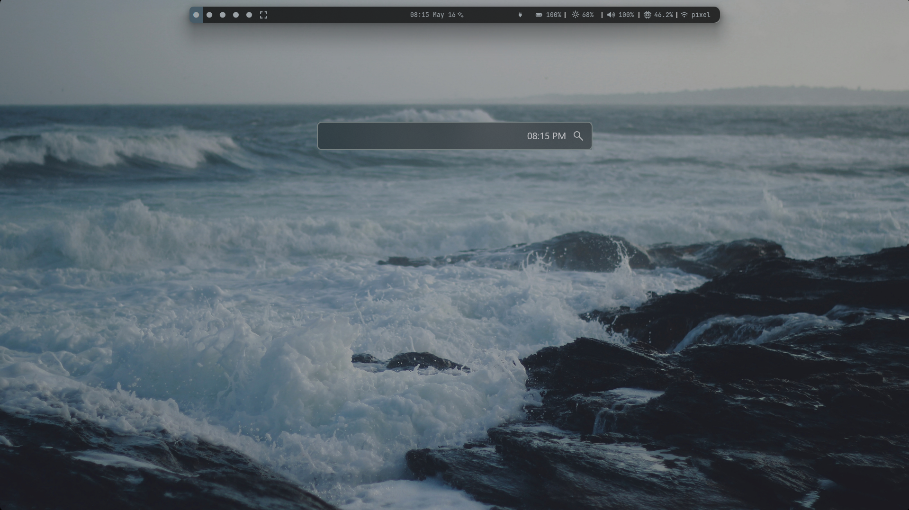
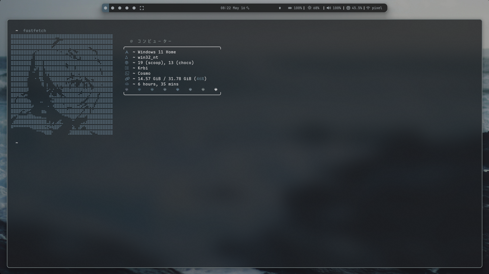

    

    
        
      
      
      

   

    
<h1 align="center">DE</h1>

    

  

    
<h1 align="center">Zed && Cosmo</h1>

    
    

  

    
<h1 align="center">Visual Studio Code</h1>

    
    

